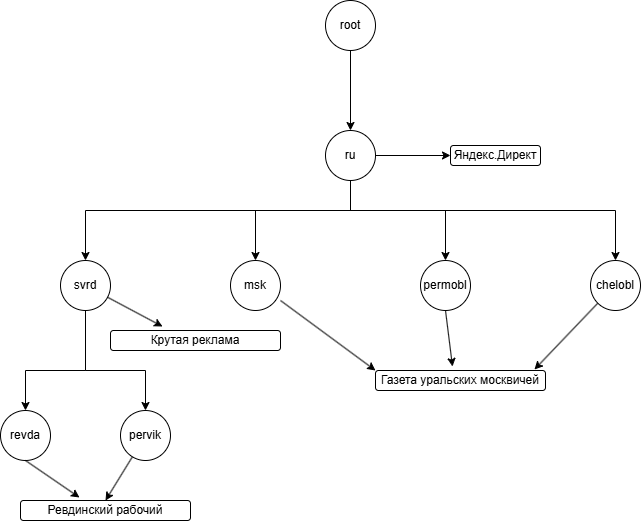

# AdPlatforms (test assignment)

## Содержание
- [Задача: Рекламные площадки](#задача-рекламные-площадки)
  - [Описание](#описание)
  - [Требования](#требования)
- [Технические детали реализации](#технические-детали-реализации)
- [Локальный запуск приложения](#локальный-запуск-приложения)


## Задача: Рекламные площадки

### Описание

Рекламодатели часто хотят размещать рекламу в каком-то конкретном регионе
(локации), например только в московской области или только в городе Малые Васюки.

Мы хотим сделать сервис, который помог бы подбирать рекламные площадки для
конкретного региона.

Все рекламные площадки перечислены в текстовом файле вместе с локациями, в
которых они действуют.

Пример файла:
```
Яндекс.Директ:/ru
Ревдинский рабочий:/ru/svrd/revda,/ru/svrd/pervik
Газета уральских москвичей:/ru/msk,/ru/permobl,/ru/chelobl
Крутая реклама:/ru/svrd
```

Здесь `Ревдинский рабочий` - это рекламная площадка, a `/ru/svrd/revda` и
`/ru/svrd/pervik` — локации, в которых действует `Ревдинский рабочий`.

Локации вложены, если одна содержит другую как префикс, например `/ru/svrd/ekb`
вложена в `/ru/svrd`, `/ru/svrd` вложена в `/ru`, `/ru/svrd/ekb` вложена в `/ru`.

Рекламная площадка действует во всех указанных локациях перечисленных через “,”.
Чем меньше вложенность локации, тем глобальнее действует рекламная площадка.

Пример:
<br>Для локации `/ru/msk` подходят `Газета уральских москвичей` и `Яндекс.Директ`.
<br>`/ru/svrd` -> `Яндекс.Директ` и `Крутая реклама`.
<br>`/ru/svrd/revda` -> `Яндекс.Директ`, `Ревдинский рабочий` и `Крутая реклама`.
<br>`/ru` -> `Яндекс.Директ`.

### Требования

Необходимо реализовать простой веб сервис, позволяющий хранить и возвращать
списки рекламных площадок для заданной локации в запросе.

Информация для реализации:
- Веб сервис должен содержать 2 метода REST API:
  1. Метод загрузки рекламных площадок из файла (должен полностью перезаписывать всю хранимую информацию).
  2. Метод поиска списка рекламных площадок для заданной локации.
- Данные должны храниться строго в оперативной памяти (in-memory collection).
- Важно получать результат поиска рекламных площадок как можно быстрее.
- Считаем, что операция загрузки файла вызывается очень редко, а операция поиска рекламных площадок очень часто.
- Программа не должна ломаться от некорректных входных данных.
 
Юнит тесты приветствуются.

## Технические детали реализации

Для хранения информации о рекламных площадках используется структура данных Prefix Tree (Trie), где каждый сегмент пути
(локации) представлен отдельной вершиной (нодой) дерева.


Например, файл из описания задачи будет сохранен в следующем виде:



При запросе платформ по локации (например: `/ru/svrd/revda`), обход дерева начинается с корневой вершины (`root`) 
и продолжается по сегментам (`ru` -> `svrd` -> `revda`), пока существует соответствующая вложенная нода. На каждом шаге
собираются рекламные площадки, ассоциированные с текущей нодой.

## Локальный запуск приложения

1. Склонировать репозиторий:
	```shell
	git clone https://github.com/schmidt-x/AdPlatforms.git
	```
2. Использовать один из следующих способов запуска:
   - Используя рантайм .NET, выполнить следующую команду в папке с `AdPlatforms.csproj`:
      ```shell
      dotnet watch 
      ```
   - Используя Docker, выполнить следующие команды в папке с `Dockerfile`:
      ```shell
      docker build -t ad-platforms-image .
      ```
      ```shell
      docker run --rm -it --name ad-platforms -p 8080:8080 ad-platforms-image --environment Development
      ```
3. Перейти на страницу http://localhost:8080/swagger/

Или попробуйте уже запущенный экземпляр приложения: http://ad-platforms.schtefan.xyz/
